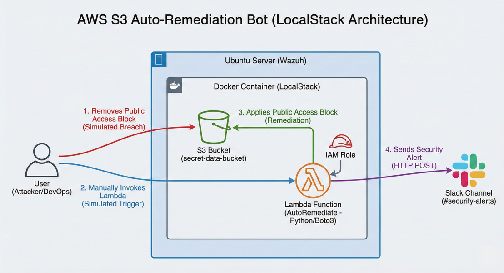
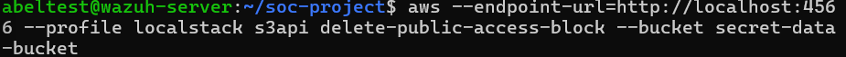
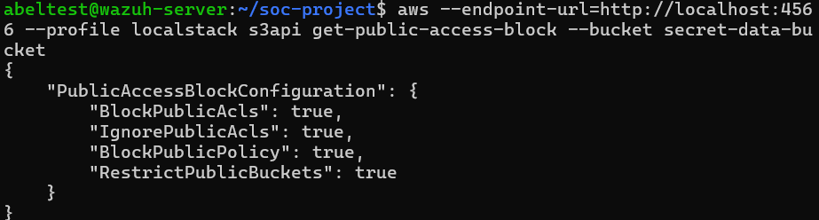
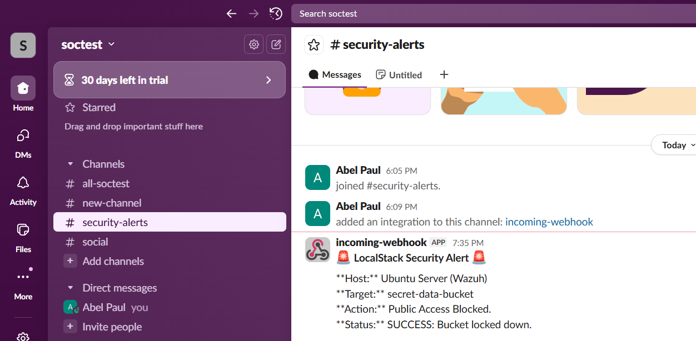

# AWS S3 Auto-Remediation Bot (LocalStack)


## Project Overview
This project is a **Security Orchestration & Automation (SOAR)** tool designed to detect and remediate cloud security misconfigurations in real-time.

Built using **Python (Boto3)** and **LocalStack**, it simulates an AWS environment where an S3 bucket is accidentally exposed to the public. The system detects the violation via compliance scans and automatically triggers a Lambda function to:
1.  **Block Public Access** immediately.
2.  **Alert the Security Team** via a Slack Webhook integration.

## Architecture
**Breach** (User deletes ACL) ➔ **Detection** (Manual/Event Trigger) ➔ **Remediation** (Lambda/Python) ➔ **Notification** (Slack)


## Tech Stack
* **Cloud Emulation:** LocalStack (Docker)
* **IaC & Management:** AWS CLI
* **Runtime:** Python 3.9 (Boto3)
* **Containerization:** Docker on Linux (Ubuntu)

## How to Run Locally

### 1. Prerequisites
* Docker installed and running.
* AWS CLI installed.
* `zip` utility installed.

### 2. Start LocalStack
```bash
docker run --rm -d \
  -p 4566:4566 \
  -p 4510-4559:4510-4559 \
```
## 3. Deploy the Infrastructure
```Bash

# Configure Fake AWS Credentials
aws configure --profile localstack

# Create S3 Bucket
aws --endpoint-url=http://localhost:4566 --profile localstack s3 mb s3://secret-data-bucket

# Package and Deploy Lambda
cd src
zip ../function.zip lambda_function.py
cd ..
aws --endpoint-url=http://localhost:4566 --profile localstack lambda create-function \
    --function-name AutoRemediate \
    --zip-file fileb://function.zip \
    --handler lambda_function.lambda_handler \
    --runtime python3.9 \
    --role arn:aws:iam::000000000000:role/irrelevant-role
```
## 4. Simulate the Attack & Fix
Step 1: The Attack (Expose Bucket)

```Bash

aws --endpoint-url=http://localhost:4566 --profile localstack s3api delete-public-access-block --bucket secret-data-bucket
```
Step 2: The Fix (Trigger Bot)

```Bash

aws --endpoint-url=http://localhost:4566 --profile localstack lambda invoke --function-name AutoRemediate response.json
```
Step 3: Verification Check your Slack Channel for the alert 🚨 or query the bucket status:

```Bash

aws --endpoint-url=http://localhost:4566 --profile localstack s3api get-public-access-block --bucket secret-data-bucket
```
## Project Demo

### 1. Attack Simulation 
*Simulating a user accidentally exposing the S3 bucket to the public via CLI.*


### 2. Automated Remediation & Verification 
*The Lambda function triggered, fixed the ACLs, and confirmed the bucket is private.*


### 3. Slack Notification 
*Real-time alert sent to the SOC channel upon successful remediation.*


---

## Conclusion & Future Scope

This project demonstrates the power of **Security Orchestration, Automation, and Response (SOAR)** in a cloud environment. By shifting from manual monitoring to automated remediation, we effectively reduced the "Time to Remediate" for a critical misconfiguration from minutes to seconds.

This lab proves that **Infrastructure as Code (IaC)** and **Serverless functions** are essential tools for modern SOC Analysts to enforce compliance and manage risk at scale.

### Future Improvements
To further enhance this project, the following updates are planned:
* **Wazuh Integration:** Forwarding the remediation logs to a Wazuh SIEM for centralized dashboarding.

* **Multi-Region Support:** Expanding the Lambda logic to monitor S3 buckets across all AWS regions simultaneously.
